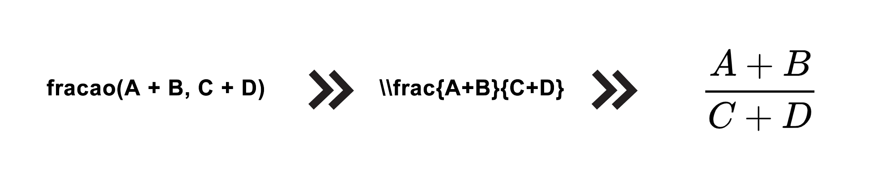

<!-- LOGO -->
<br />
<p align="center">
  <a>
    
  </a>

  <h3 align="center">Math-Converter</h3>

  <p align="center">
    Uma nova linguagem para escrita de equações matemáticas!
    <br />
  </p>
</p>

<!-- TÓPICOS -->
<!-- 

- instalação do projeto


- demonstração da linguagem

-->


<!-- PRE-REQUISITOS -->
## Pré-requisitos

Para a utilização do projeto é necessário ter instalado:
* [Node.js - 12.19.0 LTS ou superior](https://nodejs.org/en/)
* npm - 6.14.8 ou superior

    ```sh
    npm install npm@latest -g
    ```
* Máquina virtual Java na versão mais recente, 11.0.2 ou superior.

<!-- INSTALAÇÃO -->
## Instalação

1. Cópia do repositório
```sh
git clone https://github.com/micsmics/math-converter
```
2. Instalação das dependencias do projeto
```sh
npm install
```
Agora é só usar :smile:

<!-- COMO USAR -->
## Como usar

1. Crie um arquivo de texto e digite a expressão matemática de acordo com os exemplos exibidos da linguagem proposta pelo projeto.
2. Vá até a pasta do projeto
3. Execute o programa com o seguinte comando:

```sh
java -jar compilador/math-converter.jar arquivo-de-entrada.txt arquivo-de-saida.txt
```
Após a execução do comando acima, serão criados dois arquivos:
  - arquivo de saida, onde contém a expressão convertida para o formato LaTeX
  - programa em Node.js para geração da imagem da expressão com o nome run.js
  
  _é necessário que todos os arquivos (arquivo-de-entrada.txt e arquivo-de-saida.txt) estejam na mesma pasta do projeto math-converter_
  
 Para gerar a imagem da expressão, basta digitar o seguinte comando:
```sh
node run.js
```

Serão gerados dois arquivos:
  - imagem-da-expressao.png
  - imagem-da-expressao.svg
  
<!-- COMO É A LINGUAGEM -->
## Como é a linguagem?

A linguagem apresentada pelo nosso projeto é a seguinte:
```sh
  Para criação de uma matriz de 2 linhas e 3 colunas - matriz([1, 2, 3], [4, 5, 6])
  Para criar uma fração - fracao(A + B, C + D)
  Para utilizar uma expressão trigonométrica - sen^2 (x)
  Para criar uma raiz de n - raiz(n, 2 + x)
  Para colocar uma expressão entre chaves - chaves(A = B + C)
  Para criar um termo binomial - binomial(x, y)
  Para criar um somatório de x = 0 até 100 de uma expressão - somatorio(x = 0, 100, 2x + 3)
  Para criar um limite de x a ±∞ de uma expressão - limite(x, mais-ou-menos infinito, fracao(2, x))
  Para criar uma integral indefinida de uma expressão - integral(x + 2, dx)
  Para criar uma integral dupla indefinida de uma expressão - integral(x + 2 + y, dx, dy) ou integral_dupla(x + 2 + y, dx, dy)
  Para criar uma integral trila indefinida de uma expressão - integral(x + y + z, dx, dy, dz) ou integral_tripla(x + y + z, dx, dy, dz)
  Para criar uma integral definida entre 0 e 1 de uma expressão - integral([0, 1], x + 2, dx)
  Para criar uma integral dupla definida entre 0 e 1, e 0 e 10 de uma expressão - integral([0, 1], [0, 10, x + 2 + y, dx, dy) ou integral_dupla([0, 1], [0, 10, x + 2 + y, dx, dy)
  Para criar uma integral trila definida entre 0 e 1, 0 e 10, e 0 e 5 de uma expressão - integral([0, 1], [0, 10], [0, 5], x + y + z, dx, dy, dz) ou integral_tripla([0, 1], [0, 10], [0, 5], x + y + z, dx, dy, dz)
  Para criar uma integral de linha indefinida - integral_linha(x + 2, dx)
  Para criar uma integral de linha definida entre 0 e 10 - integral_linha([0, 10], x + 2, dx)
  Para declarar uma variável - $nome$ = {B + C}
  Para utilizar a variável em uma expressão - A = $nome$
```

_Para visualização da definição da linguagem basta acessar o arquivo [Math.g4](/src/Math.g4)_

<!-- EXEMPLOS DE EXPRESSOES GERADAS -->
## Exemplos de expressões geradas





<!-- O QUE FOI IMPLEMENTADO -->
## O que foi implementado no projeto?

Agora vamos apresentar as funcionalidades contidas no projeto como forma de aplicação dos conceitos aprendidos na disciplina de Construção de Compiladores 1.

<!-- ANALISADOR LEXICO -->
### Analisador Léxico

A análise léxica implementada no projeto é capaz de identificar os seguintes erros:
* **Erro de variável não fechada:**
  É sinalizado um erro quando a chamada de uma variável que deve estar no formato '$nome-variavel$' não é fechada até o pulo de linha ou até o final do arquivo:
  ```sh
  ERRO_VARIAVEL: ('$' ~('$')* ('\n' | EOF));
  ```
  
  Para uma expressão definida da seguinte forma:
  ```sh
  $a = {integral([1, 5], x^3 + 2, dx)}
  ```
  
  Temos o seguinte resultado no arquivo de saída:
  ```sh
  Linha 1: variável nao fechada
  Fim da compilacao
  ```
  
* **Erro para o nome da variável:**
  É sinalizado um erro quando o nome de uma variável não tem apenas caracteres [a-z] | [A-Z] | [0-9].
  ```sh
  ERRO_NOME_VARIAVEL: '$' ( ([a-zA-Z0-9]) | (~([a-zA-Z0-9] | '$')) )* '$';
  ```
  
  Para uma expressão definida da seguinte forma:
  ```sh
  $a2B_$ = {integral([1, 5], x^3 + 2, dx)}
  ```
  
  Temos o seguinte resultado no arquivo de saída:
  ```sh
  Linha 1: caractere inválido no nome da variável
  Fim da compilacao
  ```
  
* **Erro na declaração de uma variável:**
   É sinalizado um erro quando o sinalizador de fim de conteúdo de uma variável não é aplicado, ou seja, o conteúdo de uma variável não foi fechad. A declaração de uma variável deve ser feita no seguinte formato: _$nome-variavel$ = {conteudo-variavel}_
   ```sh
   ERRO_CONTEUDO_VARIAVEL: ('{' ~('}')* EOF);
   ```
   
   Para uma expresão definida da seguinte forma:
   ```sh
   $a$ = {integral([1, 5], x^3 + 2, dx)
   ```
   
   Temos o seguinte resultado no arquivo de saída:
   ```sh
   Linha 1: limitador de conteudo da variável não fechado
   Fim da compilacao
   ```

<!-- ANALISADOR SINTATICO -->
### Analisador Sintático

A análise sintática implementada no projeto é capaz de identificar os erros que não estão conforme a definição da linguagem. Para ver como a linguagem foi definida basta acessar o arquivo [Math.g4](/src/Math.g4).

Podemos visualizar alguns exemplos de erros sintáticos apontados pela implementação do projeto:
<!-- EXEMPLOS ANALISADOR SINTATICO -->
  * Uma matriz deve ter ao menos a entrada de uma linha. Para o seguinte caso:
    ```sh
    matriz()
    ```
    Temos o seguinte erro sintático:
    ```sh
    Linha 1: erro sintatico proximo a )
    ```
    
  * A linha da matriz deve estar entre \[ \]. Para o seguinte caso:
    ```sh
    matriz([1, 2, 3)
    ```
    
    Temos o seguinte erro sintático:
    ```sh
    Linha 1: erro sintatico proximo a EOF
    ```
    
  * Um limite de integração deve ter uma expressão e um intervalo. Para o seguinte caso:
    ```sh
    limite_integracao(a + b)
    ```
    
    Temos o seguinte erro sintático:
    ```sh
    Linha 1: erro sintatico proximo a EOF
    ```
  
  * O intervalo de uma integral deve ter duas expressões separadas por ",". Para o seguinte caso:
    ```sh
    integral([1, ], x^3 + 2x, dx)
    ```
    
    Temos o seguinte erro sintático:
    ```sh
    Linha 1: erro sintatico proximo a ]
    ```
  
  * Uma fração é composta de duas expressões, numerador e denominador. Para o seguinte caso:
    ```sh
    fracao(x^2 + 9)
    ```
    
    Temos o seguinte erro sintático:
    ```sh
    Linha 1: erro sintatico proximo a EOF
    ```
  
  _Esses foram apenas alguns exemplos que violam a definição da linguagem. Podem ser gerados muitos outros apenas olhando as definições propostas no arquivo [Math.g4](/src/Math.g4) e produzindo alguns "equívocos" para teste._
    
<!-- ANALISADOR SEMANTICO -->
  ### Analisador Semântico
  
  A análise semântica implementada no projeto é capaz de identificar os seguintes erros:
  * **Usar uma variável que ainda não foi declarada:**
    Para o seguinte caso:
      ```sh
      integral([1, 2], $a$, dx)
      ```
    
    Temos o seguinte erro semântico:
      ```sh
      Linha 1: variavel $a$ nao declarada antes do uso
      Fim da compilacao
      ```
  * **Definir uma matriz em que nem todas as linhas possuem o mesmo número de colunas:**
    Para o seguinte caso:
      ```sh
      matriz([1, 2, 3], [1, 2], [1, 2, 3])
      ```
    
    Temos o seguinte erro semântico:
      ```sh
      Linha 1: O número de colunas da matriz deve ser o mesmo para todas as linhas
      Fim da compilacao
      ```
  * **Definir uma expressão Binomial com um número de termos diferente de 2:**
    Para o seguinte caso:
      ```sh
      binomial(x)
      ```
    
    Temos o seguinte erro semântico:
      ```sh
      Linha 1: uma expressao binomial deve ter obrigatoriamente dois termos
      Fim da compilacao
      ```    
  * **Em uma integral o número de variáveis de integração deve ser igual ao número de intervalos de integração:**
    Para o seguinte caso:
      ```sh
      integral([0, 1], [0, 5], [0, 10], x + y + z, dx, dy)
      ```
    
    Temos o seguinte erro semântico:
      ```sh
      Linha 1: A quantidade de intervalos na integral e variáveis de integração deve ser a mesma
      Fim da compilacao
      ```    
  * **Uma integral dupla deve ter (se for definida) dois intervalos de integração, e sempre deve ter duas variáveis de integração:**
    Para o seguinte caso:
      ```sh
      integral_dupla([0, 1], [0, 5], [0, 10], x + y, dx, dy)
      ```
    
    Temos o seguinte erro semântico:
      ```sh
      Linha 1: A quantidade de intervalos na integral dupla deve ser 0 (no caso de uma integral indefinida) ou dois intervalos
      Fim da compilacao
      ```    
      
  * **Uma integral tripla deve ter (se for definida) três intervalos de integração, e sempre deve ter três variáveis de integração:**
    Para o seguinte caso:
      ```sh
      integral_tripla(x + y, dx, dy)
      ```
    
    Temos o seguinte erro semântico:
      ```sh
      Linha 1: São necessárias três variáveis de integração na integral tripla
      Fim da compilacao
      ```    

<!-- GERADOR DA EXPRESSAO EM LaTeX -->
